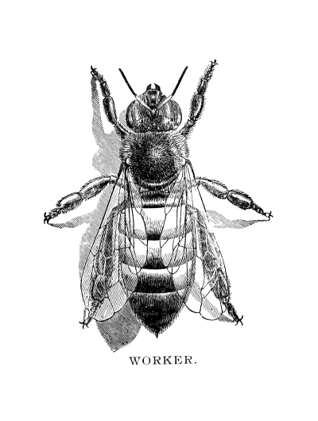

# Bee Movie Translations

  list of bee movie translations at the intersection of art and annoyance.

The art of _bee movie translation_ involves remixing the [bee movie](http://www.imdb.com/title/tt0389790/) or its trailer based on the original movie script and the occurence of the word __bee__.

Similar techniques have been explored by adventurers dedicated to algorithmic poetry such as the OuLiPo movement. Bee movie translations add a layer of video remixing and transformation that goes beyond mere textual and abstract poetry.

----

## Videos

#### Bees on Speed
_List of translations focused on cineastic effect_

###### Entire Bee Movie

* [Entire Bee Movie - every time they say _bee_ it gets faster ](https://www.youtube.com/watch?v=E6iN6VTL7v8)
* [Entire Bee Movie - every time they say _bee_ it restarts](https://www.youtube.com/watch?v=PcdHoS-hYZk)

###### Bee Movie Trailer
* [Bee Movie Trailer - every time they say _bee_ it gets faster](https://www.youtube.com/watch?v=JSKAZVuz2VM)
* [Bee Movie Trailer - every time they say _bee_ it gets slower](https://www.youtube.com/watch?v=ZW-lDX2UcL0)
* [Bee Movie Trailer - every time they say _bee_ it gets more distorted](https://www.youtube.com/watch?v=T25QGcYPh0s)
* [Bee Movie Trailer - everytime they say _bee_ it duplicates ](https://www.youtube.com/watch?v=CZSBgy_BUhs)

#### Busy Bees
_List of translations focused on language_

###### Bee Movie Script
* [Bee Movie Script - text to speech (google translate)](https://www.youtube.com/watch?v=VUYAy6zzKYk)
* [Bee Movie Script - read by brendaniel](https://www.youtube.com/watch?v=QsGYNfagHlU)
* [Bee Movie Script - in morse code](https://www.youtube.com/watch?v=1SQcYAbGGVE)
* [Bee Movie Script - in binary](https://www.youtube.com/watch?v=XaBNrDAxOJY)

###### Bee Movie Trailer
* [Bee Movie Trailer - every _bee_ is backwards](https://www.youtube.com/watch?v=2Oyc4cxE2zg)
* [Bee Movie Trailer - every time they say _bee_ it changes language ](https://www.youtube.com/watch?v=xk_hk_nG9r0)
* [Bee Movie Trailer - every _bee_ repeated by how many it was said before](https://www.youtube.com/watch?v=idjFDCYv5eI)
* [Bee Movie Trailer - every _bee_ repeated an exponential number of times](https://www.youtube.com/watch?v=0XBH6S-vbns)
* [Bee Movie Trailer - every _bee_ replaced with another letter](https://www.youtube.com/watch?v=V5eoiq4h7BA)
* [Bee Movie Trailer - every _bee_ replaced with the previous _bee_](https://www.youtube.com/watch?v=BfFcrMc0oG8)
* [Bee Movie Trailer - every _bee_ replaced with reading of the bee movie script](https://www.youtube.com/watch?v=5v5ASzKiZWI)
* [Bee Movie Trailer - all dialogue in morse code](https://www.youtube.com/watch?v=e06vHlMpSrE)
* [Bee Movie Trailer - all words sorted alphabetically](https://www.youtube.com/watch?v=xYds3tKd3oo)

###### Entire Bee Movie
* [Entire Bee Movie - only the word _bee_ in it ](https://www.youtube.com/watch?v=TByiofHaEKk)
* [Entire Bee Movie - all words sorted alphabetically](https://www.youtube.com/watch?v=T-UVMyAOQqk)
* [Entire Bee Movie - every _bee_ replaced by _Barry B Benson_ and every _Barry_ is replaced by _bee_](https://www.youtube.com/watch?v=OqijL4jVrY8)
* [Entire Bee Movie - every voice actor replaced with _brendaniel_](https://www.youtube.com/watch?v=CkMFLHy4wMo)

#### Semantic Translation
_Translations based on meaning rather than words_

###### Entire Bee Movie
* [Entire Bee Movie - without bees](https://www.youtube.com/watch?v=eagjpMz2hHU)

###### Bee Movie Trailer
* [Bee Movie Trailer - all bees censored](https://www.youtube.com/watch?v=bvyzO-s9FF8)
* [Bee Movie Trailer - scenes in reverse order](https://www.youtube.com/watch?v=ddJYx6ufhBs)

#### Multiple Translation
_Multiple translations combined_

###### Bee Movie Script
* [Bee Movie Script - in morse code - text to speech](https://www.youtube.com/watch?v=EKP0xikyadw)

###### Entire Bee Movie
* [Entire Bee Movie backwards - every time they say _eeB_ it speeds up ](https://www.youtube.com/watch?v=KM74XRQKWew)
* [Entire Bee Movie backwards - without Bees - every time they say _eeB_ it speeds up ](https://www.youtube.com/watch?v=KM74XRQKWew)

----
## Resources
_Resources for making your own translations_

###### Bee Movie Script
* [Bee Movie Script - Transcript](http://www.script-o-rama.com/movie_scripts/a1/bee-movie-script-transcript-seinfeld.html)

###### Bee Movie Trailer
* [Bee Movie Trailer - HD](https://www.youtube.com/watch?v=VONRQMx78YI)

###### Entrie Bee Movie
* [Bee Movie Subtitles I](https://isubtitles.net/bee-movie-subtitles)
* [Bee Movie Subtitles II](http://www.yifysubtitles.com/movie/bee-movie-2007)

----

## Links
_Links, Tools and Software, for creating your own bee movie translations_

###### Bee Movie Meme
* [Bee movie appreciation playlist](https://www.youtube.com/playlist?list=PLsDLvNsVswMbGgGu4tOuYjqjOcMyyyI8N)
* [Why is the bee movie scriot a meme?](https://www.youtube.com/watch?v=FeHg8IBJP4I)
* [College kids react to the bee movie meme](https://www.youtube.com/watch?v=9h2v_fT0YC8)

###### Automatic Video Generation
* [Movie.py - github repo](https://github.com/Zulko/moviepy)
* [Movie.py - user guide](https://zulko.github.io/moviepy/)
* [VideoGrep - github repo](https://antiboredom.github.io/videogrep/)
* [VideoGrep - blog post](http://lav.io/2014/06/videogrep-automatic-supercuts-with-python/)

###### Experimental Text Translation
* [Applied Poetics -  online lab for potential literature](http://appliedpoetics.org/)
* [Translating Translating Apollinaire -  a preliminary report](http://www.bpnichol.ca/archive/documents/translating-translating-apollinaire-preliminary-report)

----

## Contributing

_Your contributions are appreciated_

